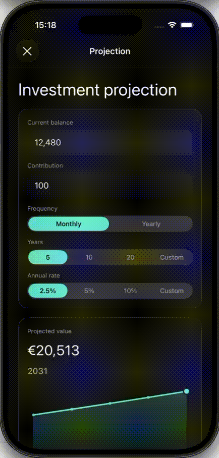
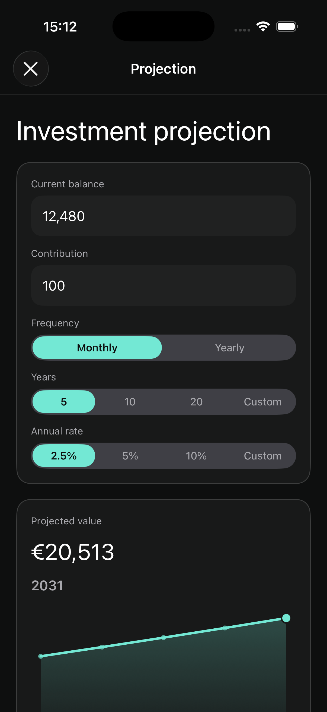
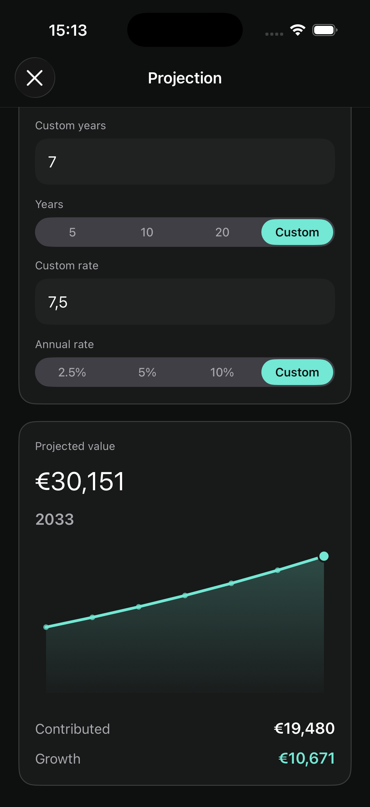
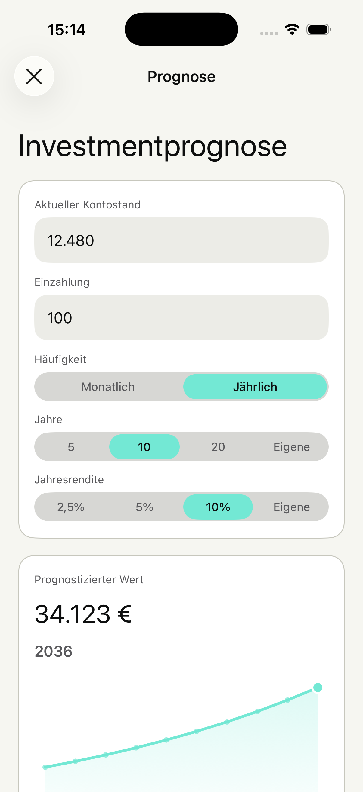
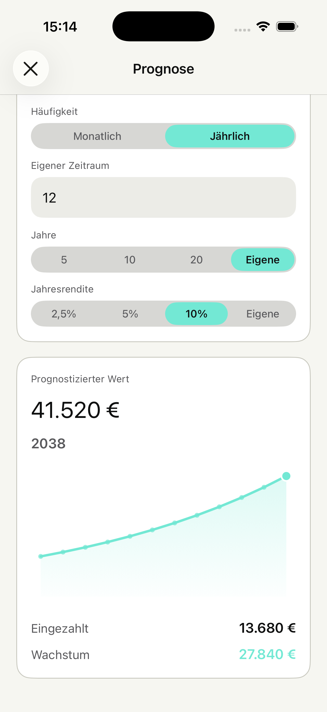

# InvestmentProjectionSDK

UIKit-only iOS SDK for investment growth projections, contribution planning, and APY scenario modeling.

It is designed for broker, fintech, and wealth apps that want to embed a reusable investment projection experience instead of building one-off screens around a single formula.

## Why

Investment projection is useful for both users and products.

- Users can understand what recurring deposits may become over time.
- Product teams can surface a practical planning tool that encourages deposits and long-term engagement.
- Host apps can embed either a calculation engine or a ready-to-present UIKit flow, depending on their integration needs.

## Features

- Compound growth projections with yearly breakdowns
- Monthly and yearly contribution schedules
- APY presets plus custom APY input
- Investment year presets plus custom year input
- Interactive yearly chart with point selection
- Reusable UIKit presentation flow
- Standalone Core module without UI
- Host-driven theming for colors, spacing, and surfaces
- English and German localization
- Unit-tested calculation and UI state logic

## Preview

<p align="center">
  Interactive SDK flow
</p>

<p align="center">
  
</p>

<p align="center">
  English, dark appearance
</p>

<p align="center">
  
  &nbsp;
  
</p>

<p align="center">
  German, light appearance
</p>

<p align="center">
  
  &nbsp;
  
</p>

## Package Structure

The package ships with two public libraries:

- `InvestmentProjectionCore`: calculation models, validation, and projection engine
- `InvestmentProjectionUI`: ready-to-present UIKit flow built on top of `InvestmentProjectionCore`

## Requirements

- iOS 17.0+
- Xcode 17+
- Swift Package Manager

## Installation

Add the package in Xcode:

1. Open `File > Add Package Dependencies...`
2. Enter your repository URL, for example:

```text
https://github.com/advanc3dUA/InvestmentProjectionSDK
```

3. Choose one or both products:

- `InvestmentProjectionCore`
- `InvestmentProjectionUI`

## Quick Start: UIKit UI

Use `InvestmentProjectionUI` when you want a ready-made flow that can be presented from your host app.

```swift
import UIKit
import InvestmentProjectionCore
import InvestmentProjectionUI

final class PortfolioViewController: UIViewController {
    @objc private func openProjection() {
        let viewController = InvestmentProjectionFlowFactory.makeViewController(
            initialInput: ProjectionInput(
                currentBalance: 12_480,
                contributionAmount: 100,
                contributionFrequency: .monthly,
                investmentYears: 10,
                annualRate: 5
            ),
            configuration: ProjectionConfiguration(
                fallbackAnnualRate: 2.5,
                annualRatePresets: [2.5, 5, 10],
                investmentYearPresets: [5, 10, 20]
            ),
            theme: InvestmentProjectionTheme(
                accentColor: .systemMint,
                positiveColor: .systemGreen
            ),
            locale: Locale(identifier: "en_US"),
            currencyCode: "EUR"
        )

        let navigationController = UINavigationController(rootViewController: viewController)
        present(navigationController, animated: true)
    }
}
```

## Quick Start: Core Only

Use `InvestmentProjectionCore` when you want calculation logic without the SDK UI.

```swift
import InvestmentProjectionCore

let calculator = ProjectionCalculator()

let input = ProjectionInput(
    currentBalance: 5_000,
    contributionAmount: 250,
    contributionFrequency: .monthly,
    investmentYears: 15,
    annualRate: 7
)

let result = try calculator.calculate(
    input: input,
    configuration: ProjectionConfiguration()
)

print(result.finalBalance)
print(result.totalContributions)
print(result.totalGrowth)
print(result.yearlyProjection)
```

## Configuration

`ProjectionConfiguration` controls projection behavior and input limits.

```swift
let configuration = ProjectionConfiguration(
    fallbackAnnualRate: 2.5,
    annualRatePresets: [2.5, 5, 10],
    investmentYearPresets: [5, 10, 20],
    defaultCompoundingFrequency: .monthly,
    maximumInvestmentYears: 50,
    maximumAnnualRate: 100
)
```

Key behaviors:

- If the input does not provide an annual rate, the SDK uses `fallbackAnnualRate`.
- If the current balance is unknown, you can pass `0`.
- The UI uses `annualRatePresets` and `investmentYearPresets` to build standard scenarios.

## Theming

`InvestmentProjectionUI` is host-driven and does not assume a specific visual brand.

You can customize:

- Background and surface colors
- Primary and secondary text colors
- Accent and positive colors
- Input field colors and sizing
- Segmented control styling
- Corner radius, spacing, and content insets
- Keyboard appearance

Example:

```swift
let theme = InvestmentProjectionTheme(
    backgroundColor: .systemBackground,
    surfaceColor: .secondarySystemBackground,
    primaryTextColor: .label,
    secondaryTextColor: .secondaryLabel,
    accentColor: .systemMint,
    positiveColor: .systemGreen,
    borderColor: .separator,
    inputBackgroundColor: .tertiarySystemBackground,
    inputTextColor: .label,
    controlBackgroundColor: .tertiarySystemFill,
    errorTextColor: .systemRed,
    selectedControlTextColor: .systemBackground,
    cornerRadius: 18,
    surfaceBorderWidth: 1
)
```

The SDK supports dynamic colors, so host apps can react to light and dark appearance changes.

## Localization

The UI currently supports:

- English
- German

The host app controls the locale passed into the SDK:

```swift
let germanFlow = InvestmentProjectionFlowFactory.makeViewController(
    locale: Locale(identifier: "de_DE"),
    currencyCode: "EUR"
)
```

## Testing

The repository includes:

- Core calculation tests
- UI view model and localization tests

Run package tests with:

```bash
xcodebuild -scheme InvestmentProjectionSDK-Package \
  -destination 'platform=iOS Simulator,name=iPhone 17 Pro,OS=26.2' \
  test
```

## Demo App

A local demo app is used to validate integration and record showcase material. It is intentionally not part of the public package repository and is not required to use the SDK.

## Roadmap

- Additional localization support
- Accessibility polish
- More host-level formatting hooks
- Additional contribution schedule presets
- Optional analytics integration points
- Extended chart interaction and presentation options

## License

This project is available under the MIT License. See [LICENSE](LICENSE).
